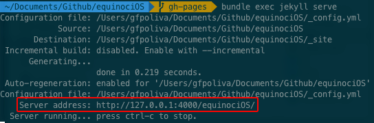

#equinociOS

No dia 20 de março acontece o [Equinócio](https://pt.wikipedia.org/wiki/Equinócio)*! Para celebrarmos este evento, iremos escrever, a partir do primeiro dia do mês, 20 artigos sobre temas de conhecimento elemental que qualquer desenvolvedor iOS deve dominar.

## Workflow de colaboração
Para colaborar com algum artigo, o autor deve seguir o seguinte fluxo:

1. Abrir uma [issue](https://github.com/CocoaHeadsBrasil/equinociOS/issues) contendo:
    - Título do artigo
    - Descrição sucinta do artigo
    - Data de publicação
2. Escrever o artigo e fazer o Pull Request para esse repositório, no branch `gh-pages`
3. Certificar-se de que o artigo se encontra sob a licença [Creative Commons](https://br.creativecommons.org/)

## Como fazer Pull Request do artigo
- Faça um fork, baixe ou clone o repositório `https://github.com/CocoaHeadsBrasil/equinociOS.git`
- Escreva seu artigo dentro do diretório [`_posts`](https://github.com/CocoaHeadsBrasil/equinociOS/tree/gh-pages/_posts) (que contém todos os posts do blog e que por sua vez são escrito na linguagem de marcação markdown).
- Faça o Pull Request

## Estrutura do post
**Todos os posts** devem ter o seguinte nome: `2017-02-15-welcome-to-jekyll.markdown`, onde `YYYY-MM-DD-nome-do-artigo.markdown`.

**Todos os posts** devem conter o seguinte cabeçalho:

    ---
    layout:     post
    title:      "Titulo do Artigo"
    subtitle:   "Subtitulo do Artigo"
    date:       YYYY-MM-DD 12:00:00
    author:     "Nome do Autor"
    header-img: "img/nomeDoUsuario/imagem.jpg" (imagem de cabeçalho)
    category:   Categoria
    ---

### Como salvar imagens
Caso seu post tenha imagens, você deve adiciona-las no diretório [`img`](https://github.com/CocoaHeadsBrasil/equinociOS/tree/gh-pages/img). **Porém não insira a imagem na raíz do diretório!** Crie um novo diretório com o nome do seu usuário e salve suas imagens nele. ;)

Sempre que você for utilizar a imagem, insira o caminho dela: `img/nomeDoUsuario/imagem.jpg`

### Como utilizar as imagens nos posts
Utilize `{{ site.baseurl }}` para concatenar com o diretório de imagem, como no exemplo abaixo: 

``

### Como editar markdown
Para escrever seu artigo, você pode utilizar editores markdown como o [MacDown](http://macdown.uranusjr.com/) ou [Atom](https://atom.io/packages/markdown-writer)!

## Revisão dos artigos
É importante os colaboradores revisarem os artigos para não serem publicados com erros ortográficos ou erros técnicos!

Você já pode ir fazendo Pull Request do seu artigo dentro do diretório [`_posts`](https://github.com/CocoaHeadsBrasil/equinociOS/tree/gh-pages/_posts), pois ele só será exibido quando a data que foi especificada no cabeçalho chegar!

**É muito importante seu artigo estar pronto alguns dias antes da data de publicação, caso contrário medidas serão tomadas para manter as publicações diárias.**

## Como rodar localmente
1. Pelo terminal, vá ao diretório raíz onde seu equinociOS está localizado
2. Caso não possua o Bundler instalado, execute `sudo gem install bundler`
2. Se for a primeira vez que você irá rodar esse projeto, execute `bundle install` para garantir que todas as dependências que o projeto utiliza existem. Caso negativo, o download será efetuado
2. Execute `jekyll serve` ou simplesmente `jekyll s`
3. Confira qual foi o *Server Address* gerado pelo jekyll 
4. Abra o navegador e entre no endereço

## Data de Publicação
- **01/03/2017:** **[[Data disponível - Reservar Data](https://github.com/CocoaHeadsBrasil/equinociOS/issues/new?title=[01/03/2017]%20%3CTitulo%20do%20seu%20artigo%3E&body=<Descrição%20do%20seu%20artigo>)]**
- **02/03/2017:** **[[Data disponível - Reservar Data](https://github.com/CocoaHeadsBrasil/equinociOS/issues/new?title=[02/03/2017]%20%3CTitulo%20do%20seu%20artigo%3E&body=<Descrição%20do%20seu%20artigo>)]**
- **03/03/2017:** [[#131](https://github.com/CocoaHeadsBrasil/equinociOS/issues/131)] Introdução e casos de uso: Map, Filter e Reduce. artigo - by [@ezefranca](https://github.com/ezefranca) 
- **04/03/2017:** **[[Data disponível - Reservar Data](https://github.com/CocoaHeadsBrasil/equinociOS/issues/new?title=[04/03/2017]%20%3CTitulo%20do%20seu%20artigo%3E&body=<Descrição%20do%20seu%20artigo>)]**
- **05/03/2017:** [[#146](https://github.com/CocoaHeadsBrasil/equinociOS/issues/146)] Introdução a Arquitetura evolutiva - by [@cs-bruno-mazzo ](https://github.com/cs-bruno-mazzo) 
- **06/03/2017:** [[#125](https://github.com/CocoaHeadsBrasil/equinociOS/issues/125)] Por que a interface gráfica é um XML? - by [@ronflima](https://github.com/ronflima) 
- **07/03/2017:** [[#145](https://github.com/CocoaHeadsBrasil/equinociOS/issues/145)] Animações utilizando auto-layout e spring animations - by [@KaiqueDamato](https://github.com/KaiqueDamato) 
- **08/03/2017:** [[#133](https://github.com/CocoaHeadsBrasil/equinociOS/issues/133)] LLDB é seu amigo artigo - by [@Bunn](https://github.com/Bunn) 
- **09/03/2017:** [[#138](https://github.com/CocoaHeadsBrasil/equinociOS/issues/138)] Snapshot Testing artigo - by [@chrisfsampaio](https://github.com/chrisfsampaio) 
- **10/03/2017:** [[#129](https://github.com/CocoaHeadsBrasil/equinociOS/issues/129)] Reporte de Bugs Para a Apple artigo - by [@fjcaetano](https://github.com/fjcaetano) 
- **11/03/2017:** [[#143](https://github.com/CocoaHeadsBrasil/equinociOS/issues/143)] TBD artigo - by [@talesp](https://github.com/talesp) 
- **12/03/2017:** [[#123](https://github.com/CocoaHeadsBrasil/equinociOS/issues/123)] Testes de UI com Embassy e Ambassador artigo - by [@emannuelOC](https://github.com/emannuelOC) 
- **13/03/2017:** [[#118](https://github.com/CocoaHeadsBrasil/equinociOS/issues/118)] Um mergulho na construção de módulos nativos para React Native artigo - by [@emilianoeloi](https://github.com/emilianoeloi) 
- **14/03/2017:** [[#124](https://github.com/CocoaHeadsBrasil/equinociOS/issues/124)] Começando a implementar VIPER artigo - by [@vitormesquita](https://github.com/vitormesquita) 
- **15/03/2017:** [[#119](https://github.com/CocoaHeadsBrasil/equinociOS/issues/119)] TBD - (Provalvelmente meta programação) artigo - by [@fpg1503](https://github.com/fpg1503) 
- **16/03/2017:** [[#126](https://github.com/CocoaHeadsBrasil/equinociOS/issues/126)] Eu preciso reativar minha aplicação? artigo - by [@Viniciuscarvalho](https://github.com/Viniciuscarvalho) 
- **17/03/2017:** [[#132](https://github.com/CocoaHeadsBrasil/equinociOS/issues/132)] Enums pra você e pro seu código artigo - by [@dbonates](https://github.com/dbonates) 
- **18/03/2017:** [[#130](https://github.com/CocoaHeadsBrasil/equinociOS/issues/130)] Componentes de interface com responsabilidade única artigo - by [@ronanrodrigo](https://github.com/ronanrodrigo) 
- **19/03/2017:** [[#144](https://github.com/CocoaHeadsBrasil/equinociOS/issues/144)] Server-side: características de um servidor - by [@ronflima](https://github.com/ronflima)
- **20/03/2017:** [[#121](https://github.com/CocoaHeadsBrasil/equinociOS/issues/121)] Garimpando UIView desmistificando o Core Animator artigo - by [@renatosarro](https://github.com/renatosarro) 

## Artigos extras
- **21/03/2017:** [[#122](https://github.com/CocoaHeadsBrasil/equinociOS/issues/122)] Falando sobre App Coordinator artigo - by [@shonorio](https://github.com/shonorio) 
- **22/03/2017:** [[#137](https://github.com/CocoaHeadsBrasil/equinociOS/issues/137)] Layout, composição e testes A/B artigo - by [@brunogb](https://github.com/brunogb) 
- **23/03/2017:** [[#139](https://github.com/CocoaHeadsBrasil/equinociOS/issues/139)] Machine Learning em Swift artigo - by [@luksfarris](https://github.com/luksfarris) 
- **24/03/2017:** [[#127](https://github.com/CocoaHeadsBrasil/equinociOS/issues/127)] Sincronização de dados com CloudKit artigo - by [@insidegui](https://github.com/insidegui) 
- **25/03/2017:** [[#140](https://github.com/CocoaHeadsBrasil/equinociOS/issues/140)] Gerenciando subscriptions com IAP artigo - by [@reprotector](https://github.com/reprotector) 
- **26/03/2017:** [[#142](https://github.com/CocoaHeadsBrasil/equinociOS/issues/142)] Integração Contínua com Travis CI artigo - by [@serralvo](https://github.com/serralvo) 
- **27/03/2017:** [[#136](https://github.com/CocoaHeadsBrasil/equinociOS/issues/136)] CoreBluetooth na prática artigo - by [@LeonardoCardoso](https://github.com/LeonardoCardoso) 
- **28/03/2017:** [[#135](https://github.com/CocoaHeadsBrasil/equinociOS/issues/135)] Adotando Handoff em apps iOS e macOS artigo - by [@rafaelnobrepd](https://github.com/rafaelnobrepd) 
- **29/03/2017:** [[#134](https://github.com/CocoaHeadsBrasil/equinociOS/issues/134)] Interfaces Assíncronas com AssyncDisplayKit artigo - by [@gugaoliveira](https://github.com/gugaoliveira) 
- **30/03/2017:** [[#141](https://github.com/CocoaHeadsBrasil/equinociOS/issues/141)] Persistência de dados usando Core Data artigo - by [@douglastaquary](https://github.com/douglastaquary) 
- **31/03/2017:** [[#120](https://github.com/CocoaHeadsBrasil/equinociOS/issues/120)] 5 motivos para não utilizar Storyboard artigo - by [@shonorio](https://github.com/shonorio) 

## Contato
Para desenvolvedores que acharam a iniciativa interessante e quiserem se juntar e conhecer a comunidade de desenvolvedores iOS brasileira, se cadastre no [Slack do iOSDevBr](http://iosdevbr.herokuapp.com/).

(*) Em março, ocorre o equinócio de outono no hemisfério sul. No hemisfério norte, na mesma data ocorre o equinócio de primavera.
